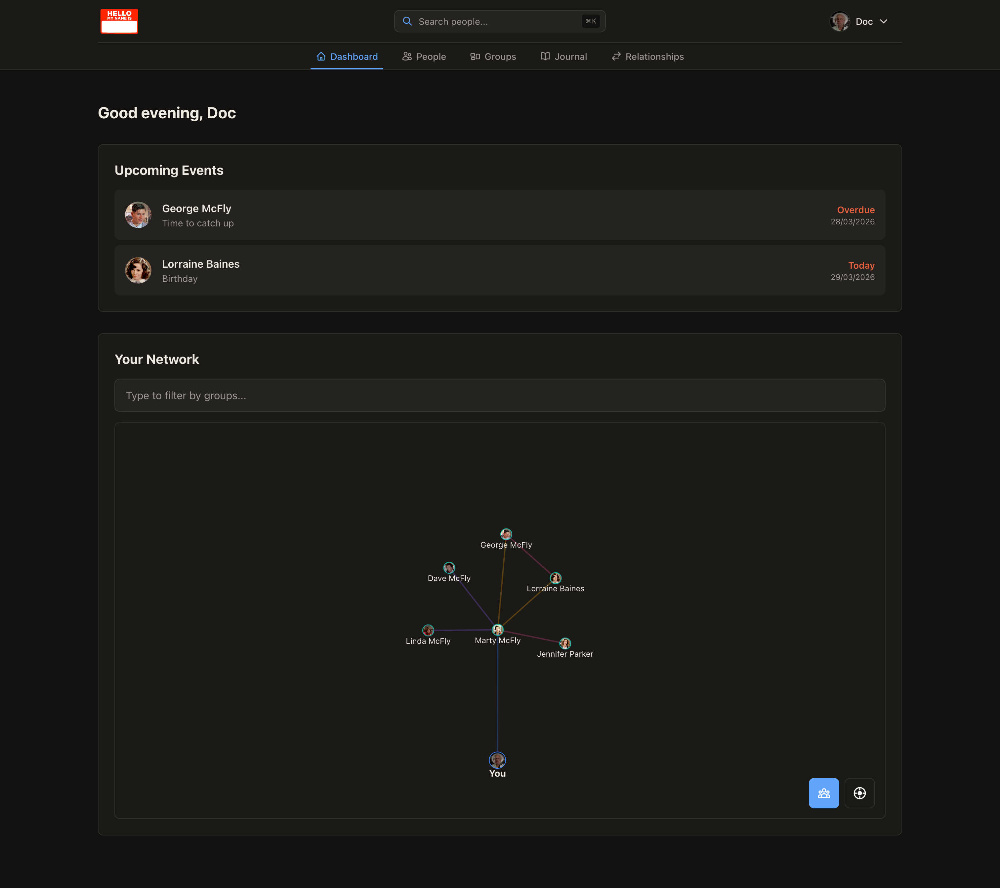
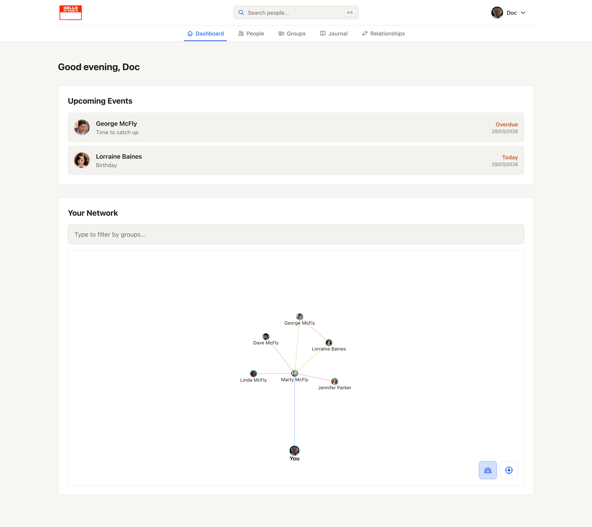
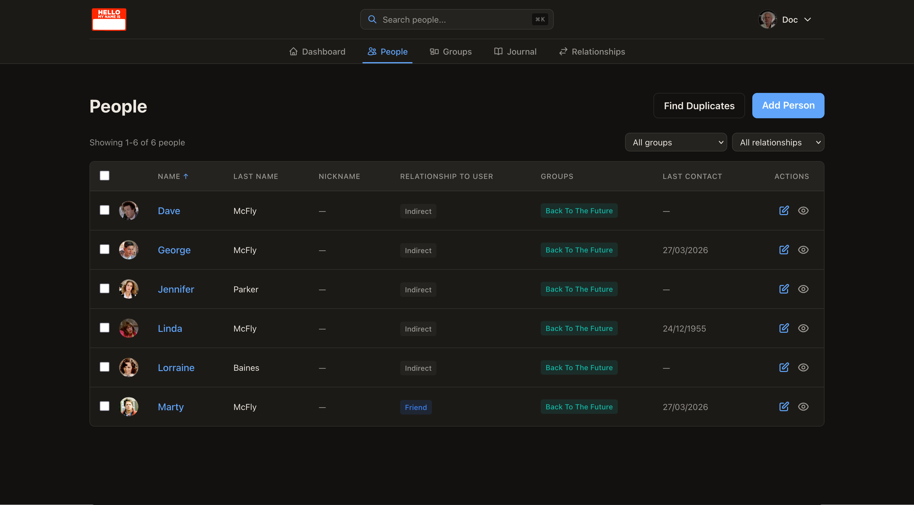
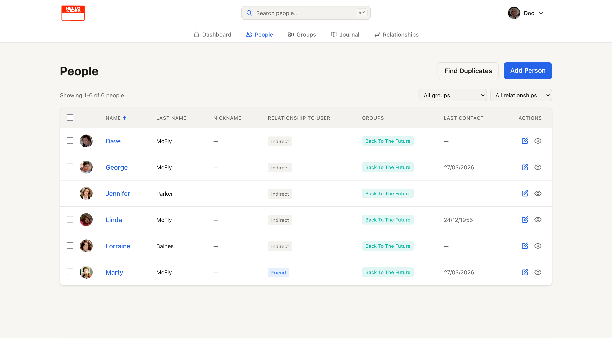
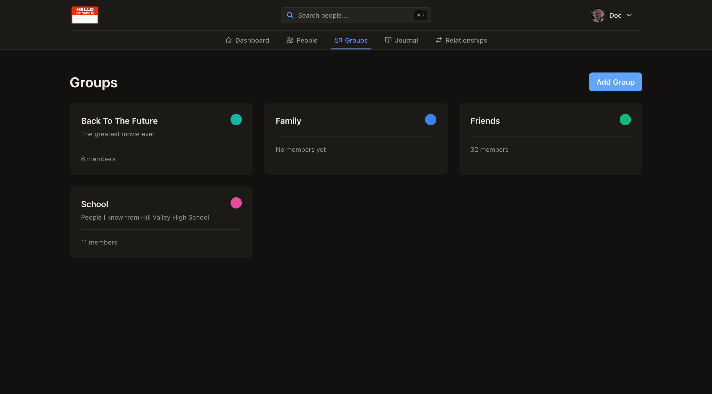
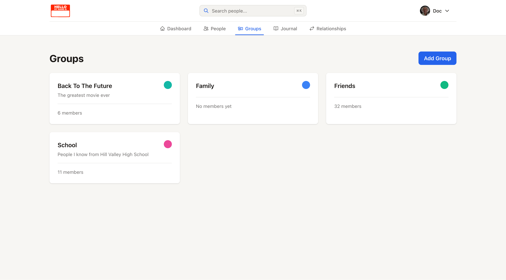
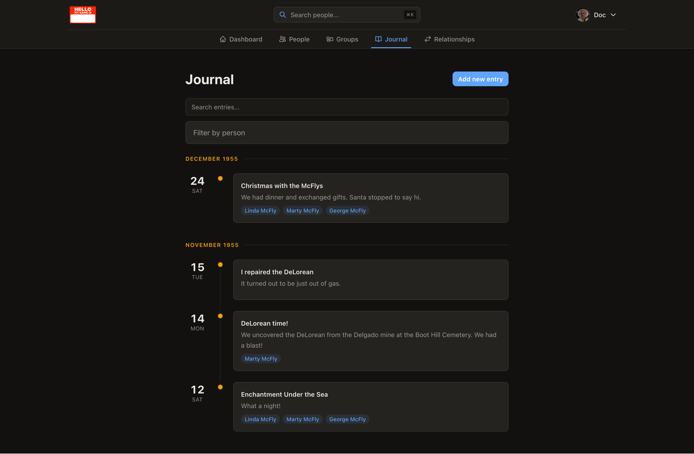
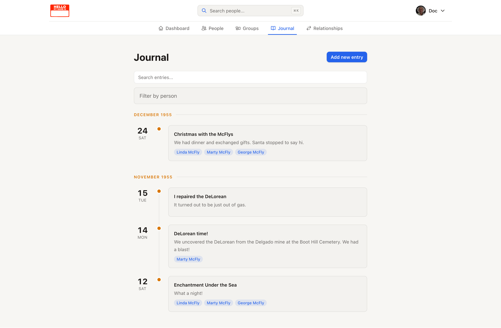
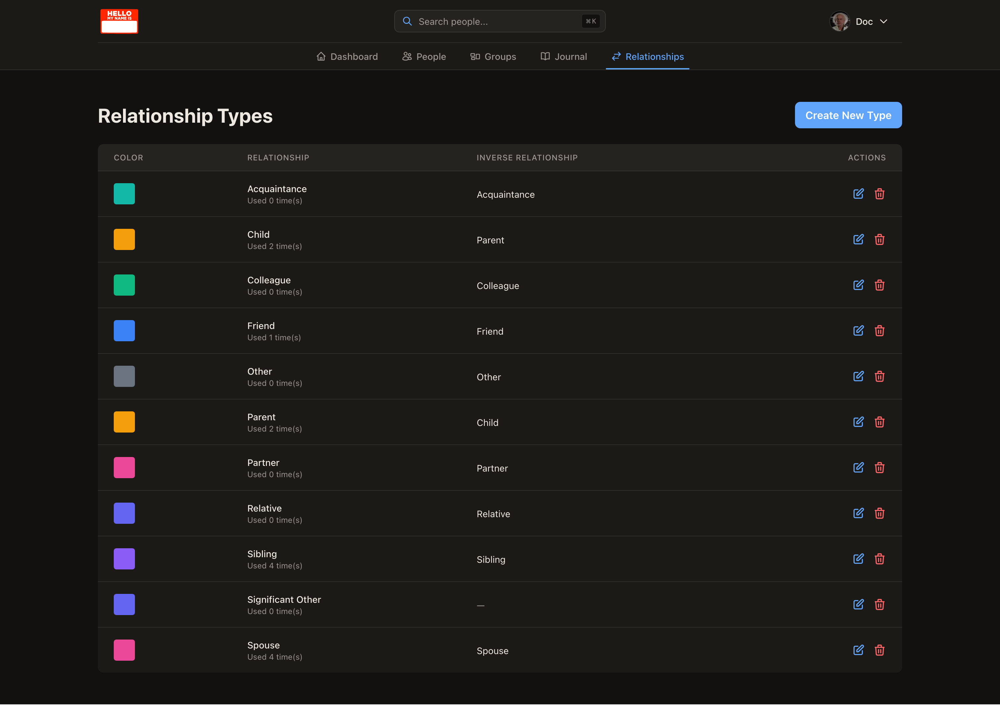
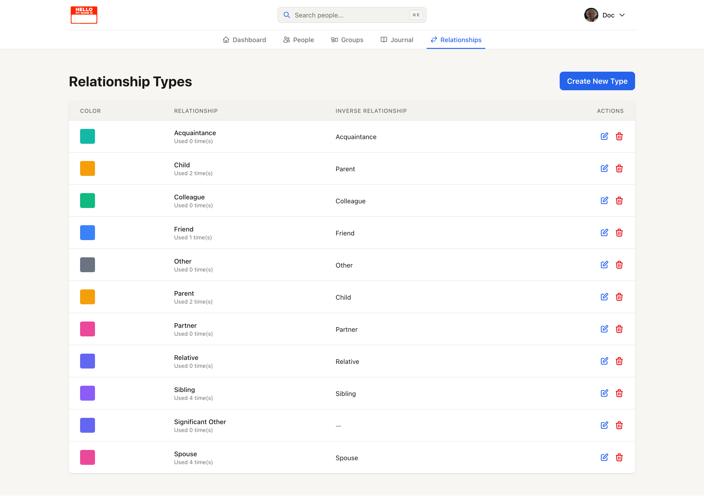

# Nametag

[](LICENSE)

> **⚠️ Active Development Notice**
>
> Nametag is under active development and may introduce breaking changes between releases. Please read the [release notes](https://github.com/mattogodoy/nametag/releases) carefully before updating to ensure a smooth upgrade process.

Nametag is a personal relationships manager that helps you remember the people in your life and how they're connected. Track birthdays, contact information, how people are connected, and visualize your network as an interactive graph.


_Dashboard with network overview and statistics_

**[Try the hosted version →](https://nametag.one)**

## Screenshots

<details>
<summary>View screenshots</summary>



_Main dashboard with a network graph of relationships_

---



_People list page_

---



_Groups page_

---



_Journal page_

---



_Relationships page_

</details>

## Features

- Track people with flexible attributes (name, birthday, important dates, and notes for everything else)
- Map relationships between people (family, friends, colleagues)
- Visualize your network with interactive graphs
- Organize contacts into custom groups
- Set reminders for important dates and staying in touch
- Full dark mode support
- Multiple languages (English, Spanish, Japanese, Norwegian, German, Chinese, Italian, Russian, Dutch)
- Mobile-responsive design
- Multi-platform Docker support (AMD64 and ARM64)

## Hosted vs Self-Hosted

We offer a hosted version at [nametag.one](https://nametag.one) with a generous free tier and affordable paid plans, which helps fund development. You can also self-host Nametag for free with unlimited contacts and complete data ownership.

See the [installation guide](https://docs.nametag.one/self-hosting/installation/) in the docs to get started with self-hosting.

## Quick Start (Self-Hosted)

```bash
mkdir nametag && cd nametag
# add a docker-compose.yml and .env file (see the installation guide)
docker compose up -d
```

Then visit `http://localhost:3000`. For the full installation guide, environment variables, email, OIDC, Redis, and reverse proxy setup, see the docs.

**[Read the full docs →](https://docs.nametag.one)**

## Contributing

We welcome contributions! See [CONTRIBUTING.md](CONTRIBUTING.md) for how to get involved, and the [development setup guide](https://docs.nametag.one/contributing/development/) for detailed instructions on running Nametag locally.

## Roadmap

ℹ️ _Contributions to any of these items are very welcome! Items that require the most help will have the **[HELP NEEDED]** tag. If you want to contribute to an item that does not have a PR or Issue associated to it, please create it yoursef._

### To do

Future features and improvements, ordered by priority:

- [ ] **[HELP NEEDED]** Mobile app (Native apps for Android and iOS are preferred)
- [ ] Add support for SQLite databases
- [ ] Add notification support [[Issue #6](https://github.com/mattogodoy/nametag/issues/6)]
- [ ] Add map to show people's locations [[Issue #26](https://github.com/mattogodoy/nametag/issues/26)]
- [ ] Support multi-user groups [[Issue #37](https://github.com/mattogodoy/nametag/issues/37)]
- [ ] Immich integration [[Issue #46](https://github.com/mattogodoy/nametag/issues/46)]
- [ ] **[HELP NEEDED]** Additional language translations (French, German, Portuguese, etc.)
- [ ] **[HELP NEEDED]** UI/UX improvements and accessibility enhancements
- [ ] **[HELP NEEDED]** Documentation improvements (API, deployment, functionality, development, etc)

### Done

Features and improvements that have already been implemented:

- [x] ~~SMTP support~~ [[Issue #4](https://github.com/mattogodoy/nametag/issues/4), [PR #21](https://github.com/mattogodoy/nametag/pull/21)]
- [x] ~~Option to disable registration~~ [[Issue #9](https://github.com/mattogodoy/nametag/issues/9), [PR #17](https://github.com/mattogodoy/nametag/pull/17)]
- [x] ~~ARM build for docker images~~ [[Issue #14](https://github.com/mattogodoy/nametag/issues/14), [PR #18](https://github.com/mattogodoy/nametag/pull/18)]
- [x] ~~Improve development setup to make contributors' lives easier~~ [[PR #25](https://github.com/mattogodoy/nametag/pull/25)]
- [x] ~~Implement CardDAV support~~ [[Issue #15](https://github.com/mattogodoy/nametag/issues/15), [PR #82](https://github.com/mattogodoy/nametag/pull/82)]
- [x] ~~API for third-party integrations~~ [[Issue #29](https://github.com/mattogodoy/nametag/issues/29), [PR #70](https://github.com/mattogodoy/nametag/pull/70)]
- [x] ~~Add photos to people~~ [[Issue #19](https://github.com/mattogodoy/nametag/issues/19), [PR #135](https://github.com/mattogodoy/nametag/pull/135)]
- [x] ~~Add custom template titles for important dates~~ [[Issue #23](https://github.com/mattogodoy/nametag/issues/23), [PR #176](https://github.com/mattogodoy/nametag/pull/176)]
- [x] ~~Add journaling capabilities~~ [[Issue #28](https://github.com/mattogodoy/nametag/issues/28), [PR #192](https://github.com/mattogodoy/nametag/pull/192)]
- [x] ~~Implement OIDC~~ [[Issue #10](https://github.com/mattogodoy/nametag/issues/10)]

## License

Licensed under the [GNU Affero General Public License v3.0](LICENSE). This ensures that if you modify and deploy Nametag, you must make your source code available.

## Support

- **Hosted version**: For support with the hosted service, email support@nametag.one
- **Self-hosting**: Open an issue on GitHub, or check the [docs](https://docs.nametag.one)
- **Security issues**: See [SECURITY.md](SECURITY.md)

## Support Development

If you find Nametag useful and want to support its development, you can buy me a coffee! ☕

<a href="https://www.buymeacoffee.com/mattogodoy" target="_blank"></a>

---

Built with care for people who care about people.
